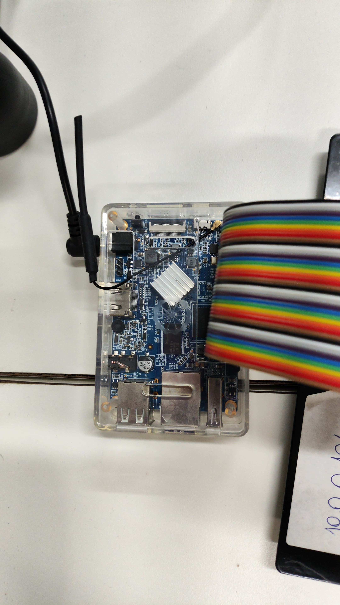
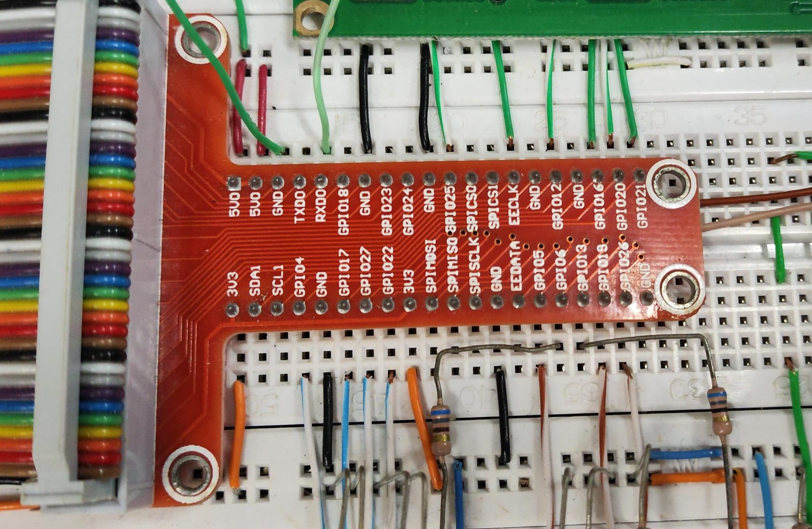
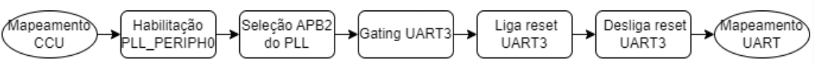
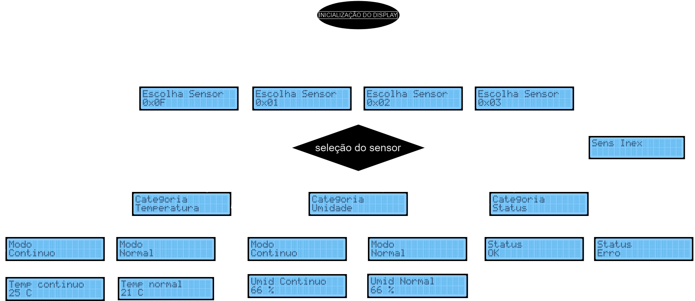
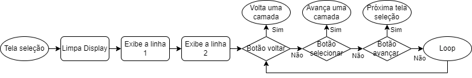
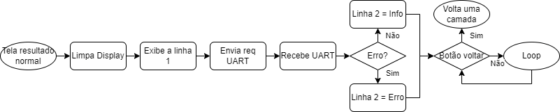
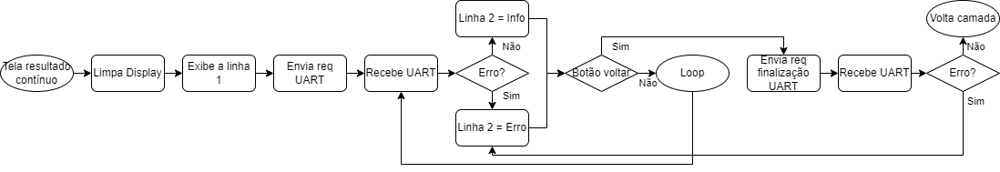
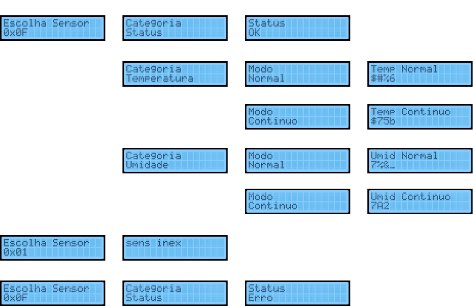

# Monitoramento de temperatura e Umidade

## Problema II - TEC499 - MI Sistemas Digitais

Professor: Anfranserai Morais Dias

Grupo: Antonio Vitor Costa Silva, Luis Felipe Pereira de Carvalho e Wesley Ramos dos Santos

## Seções

1. [Introdução](#introdução)
2. [Hardware Utilizado](#hardware-utilizado)
3. [Software Utilizado](#software-utilizado)
4. [Metodologia](#metodologia)
5. [Testes realizados](#testes-realizados)
6. [Problemas](#problemas)
7. [Documentação Utilizada](#documentação-utilizada)
8. [Execução do Projeto](#execução-do-projeto)

## Introdução

Este documento descreve em detalhes o desenvolvimento de um sistema de monitoramento de temperatura e humidade que se utiliza como linguagem o Assembly da arquitetura ARM V7 e implementado em um mini pc da familia Orange PI.

O projeto consiste em um sistema de monitoramento de temperatura e humidade ambiente através de um sensor DHT11, as opções definidas do menu através dos botões e os valores mensurados são apresentados no display LCD 16x2.
Por meio dos botões é possível:

* Navegar entre as opções do menu;
* Verificar o estado de funcionamento do sensor;
* Solicitar a temperatura atual;
* Solicitar a humidade atual;
* Iniciar e parar o sensoriamento contínuo de temperatura;
* Iniciar e parar o sensoriamento contínuo de humidade;

## Hardware Utilizado

O projeto em questão faz uso de hardware específico para seu desenvolvimento, sendo empregada uma placa Orange PI PC Plus. Esta placa possui notáveis 40 pinos GPIO e é equipada com um processador H3 Quad-core Cortex-A7, com a arquitetura ARM V7 presente no processador.

### Orange Pi PC Plus - Especificações



| CPU                    |                                          H3 Quad-core Cortex-A7 H.265/HEVC 4K |
| :--------------------- | ----------------------------------------------------------------------------: |
| GPU                    |                                                        Mali400MP2 GPU @600MHz |
| Memória (SDRAM)       |                                                    1GB DDR3 (shared with GPU) |
| Armazenamento interno  |                                       Cartão MicroSD (32 GB); 8GB eMMC Flash |
| Rede embarcada         |                                                          10/100 Ethernet RJ45 |
| Fonte de alimentação | Entrada DC,`<br>`entradas USB e OTG não servem como fonte de alimentação |
| Portas USB             |                                       3 Portas USB 2.0, uma porta OTG USB 2.0 |
| GPIO                   |                                                                      40 pinos |

### Pinagens

Através da interface GPIO da orange pi foi possivel realizar a conexão com o display LCD, os botões usados para navegação e ativação de desativação das medidas do sensor e a ESP (microcontroladora) que se conecta ao sensor DHT11:



## Software utilizado

Para o desenvolvimento e execução dos códigos, o Visual Studio Code foi utilizado como ferramenta de escrita.

Visual Studio Code (VS Code): é um editor de código-fonte gratuito e de código aberto desenvolvido pela Microsoft. É multiplataforma, altamente extensível, oferece integração com Git, suporte a várias linguagens de programação, ferramentas de depuração integradas e um terminal incorporado.

## Metodologia

### Fluxograma do funcionamento do Sistema

O fluxograma abaixo apresenta a maneira como os componentes do sistema são inicializados:

    

O processo de execução do sistema funciona da seguinte forma:

* Inicialmente é realizado o mapeamento de memória das IOUT (pinos de entrada/saída) da Orange Pi de modo ops demais componentes (display, ESP e sensor) sejam corretamente conectados à placa de desenvolvimento;
* Em seguida os pinos são configurados para que atendam o modo que foram definidos, com sendo de entrada, de saída ou de entrada e saída;
* É realizado o processo de inicialização do display LCD;
* Após é realizado o mapeamento e a configuração da UART para de que dados obtidos pelo DHT11 através da ESP sejam devidamente interpretados;
* Por fim, ocorre o processo de apresentação das telas do menu, com as quais e o uso dos botões são selecionadas e realizadas as ações que se encerram quando o usuário retorna à escolha do sensor;

A seguir, são expandidos os processos de mapeamento da memória e inicialização do display e da UART.

### Mapeamento da Memória e configuração dos pinos da GPIO

O mapeamento e configuração dos pinos da interface GPIO da Orange Pi PC Plus para uso em nosso projeto foi realizado da seguinte forma:

1. **Abertura de Arquivo de Dispositivo:**
   * Utiliza `sys_open` para abrir o arquivo associado à memória física (tipicamente `/dev/mem`).
   * Configura permissões para leitura e escrita.
   * Salva o descritor do arquivo para uso posterior.
2. **Mapeamento de Memória com `mmap2`:**
   * Emprega `mmap2` para mapear a memória física dos registros GPIO para o espaço de endereços do processo.
   * Define tamanho da página, proteções de acesso e tipo de mapeamento.
   * O endereço base da GPIO é ajustado e armazenado para acesso posterior.
3. **Configuração de Pinos GPIO:**
   * `GPIOPinIn`: Configura um pino específico como entrada.
   * `GPIOPinOut`: Configura um pino específico como saída.
4. **Manipulação de Estados dos Pinos:**
   * `GPIOPinAlto`: Define um pino como alto (nível lógico alto).
   * `GPIOPinBaixo`: Define um pino como baixo (nível lógico baixo).
   * `GPIOPinEstado`: Lê o estado atual de um pino (alto ou baixo).
5. **Acesso Direto aos Registros:**
   * Realiza operações de leitura e escrita diretamente nos registros da GPIO mapeados.
   * Utiliza o endereço base armazenado para localizar os registros específicos de cada pino.

### Fluxograma de funcionamento do Display LCD

    

O processo de execução da inicialização do display funciona no seguinte modo:

Inicialização com Alimentação:

* Processo de inicialização temporal.
* Display inicializado internamente e sem exibição.

Configuração de Função (Primeira Parte):

* Define operação de 4 bits.
* Prepara configuração completa de 4 bits.

Configuração de Função (Segunda Parte):

* Configura linha e fonte.

Controle de Exibição On/Off:

* Ativa display e cursor.
* Display mostra apenas espaços **(Limpeza do display)**.

Configuração do Modo de Entrada:

* Modo de incremento, cursor move para direita após escrita.
* Cursor move à direita, display estático.

Escrita de Dados para CGRAM/DDRAM:

* Escrita de dados no display.

### Mapeamento da memória e configuração da UART

As imagens abaixo se referem, respectivamente aos fluxograma de mapeamento de memória e de configuração.




Abaixo, há a explicação dos processo de mapeamento e configuração da UART.

1. **Abertura de Arquivo `/dev/mem`:**

* Acesso ao dispositivo de memória para mapeamento.
* Permissão de leitura e escrita.

2. **Mapeamento com `mmap2`:**

   * Mapeamento da memória física para o espaço de endereçamento virtual do processo.
   * Endereços de GPIO e UART são mapeados para controle.
3. **Habilitação e Configuração do PLL:**

   * Ativação e ajuste do PLL para fornecer o clock correto para a UART.
4. **Seleção do Clock para UART3:**

   * Direcionamento específico do clock para UART3.
5. **Controle de Reset da UART3:**

   * Realiza o reset e, em seguida, libera o reset da UART3.
6. **Configuração dos Pinos para RX e TX:**

   * Ajuste dos pinos para as funções de recepção e transmissão da UART.
7. **Ajustes de Parâmetros da UART:**

   * Configuração de paridade, tamanho do bit e baud rate.
   * Habilitação de FIFOs e remoção de bloqueios.
8. **Envio e recebimento de Dados:**

   * Transmissão de dados e endereços por meio da UART.
   * Leitura de dados recebidos pela UART, verificando o FIFO.

   ### Fluxograma do Menu

   O fluxograma abaixo apresenta a maneira como são escolhidas as opções do menu do sistema:
   

   São utilizados 3 botões para navegar e selecionar as opções do menu.


   * Os **botões 1 e 3** são utilizados para se movimentar entre as camadas de telas (exemplo: escolha entre os sensores (0x0F -> 0x01 -> 0x02 -> 0x03) e entre as categorias (temperatura, umidade e status)).
   * O **botão 2** é utilizado para selecionar o sensor a ser utilizado e as ações que devem ser realizadas (Categoria e Modo).

### Processo de exibição

Abaixo são apresentados os fluxogramas dos processos de exibição das informações no display LCD conforme os dados solicitados.

#### Tela de seleção



* Formação genérica de telas de seleção (sensor, categoria, modo);
* Linha 1 fixa para cada camada, linha 2 varia por opção;

#### Tela de Resultado no modo normal (unica requisição)

* Linha 1 é a categoria e modo;
* Linha 2 depende do dado recebido pela UART;

#### Tela de Resultado no modo contínuo



* Linha 1 é a categoria e modo selecionado
* Linha 2 depende do dado recebido pela UART

### Solução do Problema

Para a criação do projeto foi utilizada a linguagem assembly e um subconjunto do conjunto de instruções da arquitetura ARM V7, bem como a utilização do editor de texto Visual Studio Code, para a elaboração dos códigos fonte. O projeto foi sintetizado utilizando um computador de placa única, o Orange PI PC Plus, ao qual foram conectados periféricos como botões de pressão (push buttons) e um display LCD de 16x2 caracteres.

A solução desenvolvida é composta por arquivos fonte assembly (.s) e por um arquivo Make (Makefile), sendo eles:

```
├── gpio.s
├── lcd.s
|── uart.s
├── main.s
└── makefile
```

O arquivo `gpio.s` tem como principal propósito fornecer um conjunto de macros em Assembly para controle direto dos pinos de entrada e saída (GPIO) da Orange Pi, permitindo as operações como mapeamento de memória para acesso aos GPIOs, configuração de pinos como entrada ou saída, definição de estados alto ou baixo para os pinos e leitura de seus estados atuais. Estas funcionalidades são essenciais para interagir com vários componentes de hardware em nível de sistema embarcado.

O arquivo `lcd.s` tem como principal propósito fornecer uma biblioteca de rotinas em Assembly para controlar e interagir com o display LCD utilizado no projeto através de GPIOs da Orange PI. Este arquivo inclui funções para inicialização do LCD, escrita de textos e números, manipulação do cursor, e controle das configurações de exibição, permitindo ao usuário uma interface de baixo nível e flexível para a exibição de dados no LCD.

O arquivo `uart.s` tem como principal propósito configurar e gerenciar a comunicação através da interface UART (Universal Asynchronous Receiver/Transmitter) do projeto. Ele contém macros e funções em Assembly para inicializar e configurar a UART, incluindo o mapeamento de memória necessário, configuração do clock, definição dos parâmetros de transmissão como o baud rate e o tamanho da palavra, e configuração dos pinos para as funções de transmissão e recepção. Além disso, o arquivo fornece funcionalidades para enviar e receber dados, lidando com os detalhes de baixo nível do hardware da UART.

"O arquivo `main.s` tem como principal propósito servir como o código principal do projeto, ele é usado para integralizar os demais códigos e gerenciar a a interface de usuário através de botões e um display LCD, configurando e controlando as comunicações UART para interagir com a ESP e o sensor DHT11, e manipulando entradas e saídas de GPIO. O código está estruturado para inicializar os periféricos necessários, exibir informações e responder a entradas do usuário, mantendo um loop de controle para monitorar e gerenciar as interações do sistema."

O arquivo `makefile` tem como principal propósito automatizar o processo de compilação do principal arquivo assembly do projeto.

## Documentação utilizada:.

[Datasheet da ](https://drive.google.com/drive/folders/1JmgtWTlGA-hPv47cLtEYZa-Y3UZPSQNN)Orange PI PC Plus/AllWinner : Contém todas as informações relacionadas ao funcionamento dos pinos da SBC Orange Pi Pc Plus, bem como seus endereços de memória e informações extras sobre como acessá-las e enviar dados para os pinos relacionados a entrada e saída de propósito geral (GPIO).

[Datasheet do display LCD](https://www.sparkfun.com/datasheets/LCD/HD44780.pdf): Como citado anteriormente, o modelo do display LCD é o Hitachi HD44780U, e sua documentação nos permite descobrir o algoritmo responsável pela inicialização do display bem como o tempo de execução de cada instrução, além da representação de cada caractere em forma de número binário

[Tabela de syscalls do Linux 32 bits para ARM](https://chromium.googlesource.com/chromiumos/docs/+/master/constants/syscalls.md#arm-32_bit_EABI): Documentação contendo tabela de chamadas ao sistema operacional como chamadas de nanoSleep, ou de escrita para serem executadas

[Raspberry Pi Assembly Language Programming, ARM Processor Coding](https://link.springer.com/book/10.1007/978-1-4842-5287-1): Livro que mostra diversos casos de exemplo na prática do uso da linguagem Assembly na programação de dispositivos de placa única, no livro foi usado a Raspberry Pi.

## Testes Realizados

Abaixo são aprsentados alguns testes realizados com o proposito de verificar o funcionamento do projeto:



No primeiro teste o sensor de endereço 0x0F é selecionado e é verificado o estado de funcionamento do mesmo.

No segundo, através do sensor 0x0F é solicitada a temperatura do ambiente, sendo no modo normal e no modo continuo.

No terceiro, através do sensor 0x0F é solicitada a umidade do ambiente, tanto no modo normal como no continuo.

No quarto teste foi escolhido um dos demais sensorres (**0x01, 0x02 e 0x03**) que é exibido como resposta **'Sens Inex**' o que indique de nenhum desses sensores existem.

No quinto e ultimo teste, foi solicitado novamente o estado de funcionamento do sensor 0x0F, que, ao ser desconectado, acusa estado de '**erro'**.

Durante a realização dos teste pode-se notar que ao solicitar os valores de temperatura e umidade em qualeur um dos modos há o recebimento de valores incorretos (lixo) ou não recebimento de nenhum valor o que pode indicar que há problema no recebimento dos dados mensurados na interface uart do projeto.

## Problemas do Projeto

Durante a construção do projeto foram constatados os seguintes problemas:

* Exibição incorreta dos dados solicitados (lixo ou inexitência dos dados);
* Recebimento de dados incorretos através da UART;
* Leitura incorreta do pressionamento dos botões;

## Execução do projeto:

Em posse do código desse repositório e de um dispositivo com processador de arquitetura ARM, para testar o funcionamento do programa execute o comando:

```
make all
```

#### [Voltar ao topo](#Monitoramento-de-temperatura-e-Umidade)
